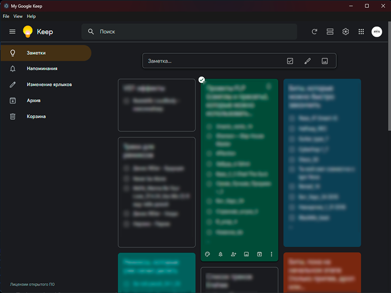

# My Google Keep

**Unofficial desktop client for Google Keep** built with Electron.



## Features
- 🪟 Remembers window size, position, and fullscreen state
- 📦 Available as installer and portable version
- 🖥️ Native menu with About dialog
- 🔗 Open source (MIT license)

## Download
Get the latest version from the [Releases](https://github.com/mntrofficial/my-google-keep/releases) page.

- `My Google Keep Setup 1.0.0.exe` – classic Windows installer (creates shortcuts)
- `MyGoogleKeepPortable.exe` – portable version, no installation required

## Development
```bash
npm install
npm start